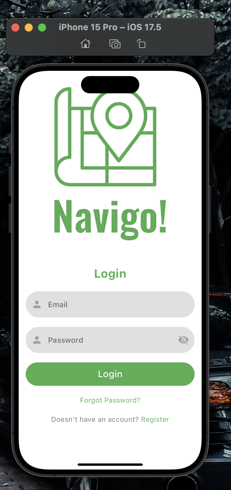
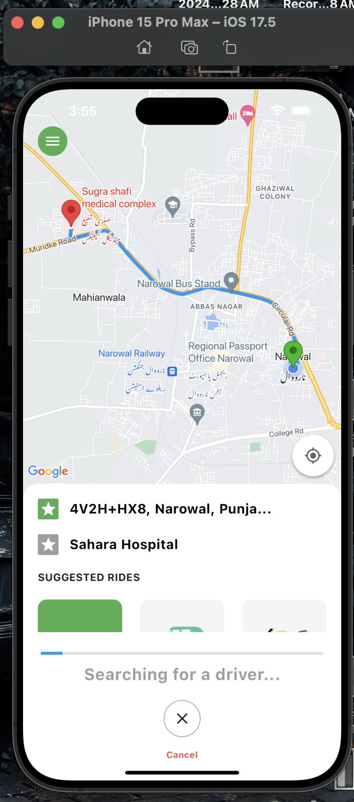
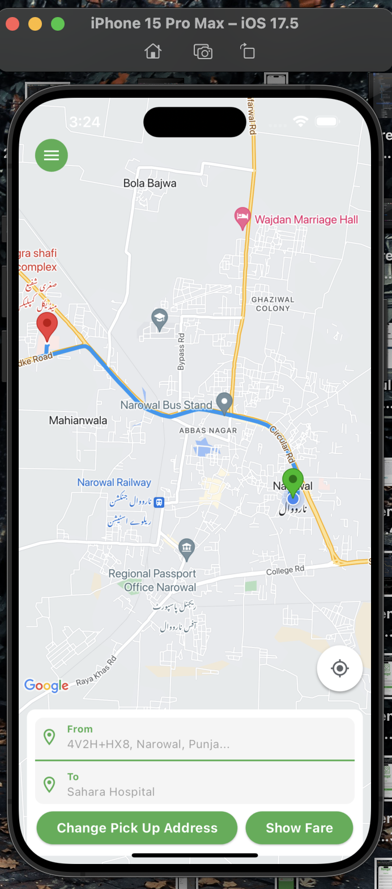

# Navigo On Drivers


Navigo On Drivers is a Flutter-based mobile application similar to Uber, designed specifically for drivers. This app allows drivers to receive ride requests, navigate to pick-up locations, and track their earnings. It integrates with Firebase for backend services including authentication, real-time database, and cloud functions.

## Features

- **Driver Registration and Authentication**: Secure sign-up and login using Firebase Authentication.
- **Ride Requests**: Receive ride requests from passengers.
- **Navigation**: Built-in navigation to pick-up and drop-off locations.
- **Earnings Tracking**: Monitor earnings from completed rides.
- **Real-time Updates**: Get real-time updates and notifications using Firebase Cloud Messaging.

## Screenshots

Here are some screenshots of the app:





*Navigation*

## Installation

To run this application, ensure you have Flutter and Dart installed on your machine. Follow the instructions below to set up the project:

1. Clone the repository:
    ```bash
    git clone https://github.com/ahsan668/navigo_on_drivers.git
    cd navigo_on_drivers
    ```

2. Install dependencies:
    ```bash
    flutter pub get
    ```

3. Set up Firebase:
    - Create a Firebase project at [Firebase Console](https://console.firebase.google.com/).
    - Enable Firebase Authentication and Firestore Database.
    - Download the `google-services.json` file for Android and `GoogleService-Info.plist` file for iOS and place them in the respective directories (`android/app` and `ios/Runner`).

4. Run the app:
    ```bash
    flutter run
    ```

## Configuration

### Firebase

Ensure that you have set up Firebase correctly by following the official [Firebase documentation](https://firebase.google.com/docs/flutter/setup).

### APIs

If you are using any external APIs, ensure that you have included the necessary configurations in your project.

## Contributing

We welcome contributions to enhance the functionality of Navigo On Drivers. To contribute, please follow these steps:

1. Fork the repository.
2. Create a new branch (`git checkout -b feature/your-feature-name`).
3. Make your changes.
4. Commit your changes (`git commit -m 'Add some feature'`).
5. Push to the branch (`git push origin feature/your-feature-name`).
6. Create a pull request.

## License

This project is licensed under the MIT License - see the [LICENSE](LICENSE) file for details.

## Contact

For any queries or support, please contact:

- **Name**: Ahsan Raza
- **Email**: ahsan.dox@gmail.com


---

Thank you for using Navigo On Drivers!